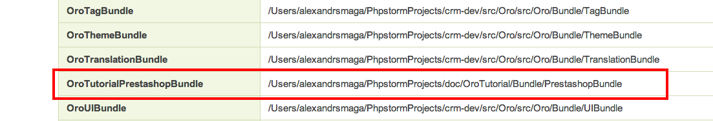

.. index::
    single: Integration
    single: Channel; Channel type

Introduction to Channels
========================

Overview
--------

**OroCRM** comes to us as multi channel CRM system based on **Oro Platform**.
What does exactly *"multi channel"* mean? What is *"channel"*? Multi channel implies that **OroCRM** can work with data
that comes from different sources, such as contact forms, e-commerce websites, ERP-systems, or whatever you want. So, basically
**channel** is some kind of data source to work with.

Oro Platform built-in facilities
--------------------------------

In the same time **Oro Platform** is the foundation for modern web applications(where the lion's share is e-commerce
specific applications) and it comes with set of built-in features that relate to integration and business entities.

**OroBusinessEntitiesBundle** - defines abstraction classes for the most popular data types. There are *cart*, *cart item*,
*order*, *order item*, *person*, *person group* and *product* entities. Those classes are based on generalized structures from
`schema.org <http://schema.org>`_ with some improvements. Those entities may be extended with platform specific fields,
but definition on the platform level might be useful when some kind of data processing needs to be done for all types of
data. For example, it might be useful to display grid with all customers that come from different systems and have different
sets of attributes, but developer could rely on fields from abstraction level and show information that is shared between
all of them.

**OroIntegrationBundle** - is responsible for interaction between third party systems/services and the platform. It extends
**OroImportExportBundle** to process data in background using other platform features such as cron and process queue.
General purpose of this bundle is allowing developers to create integration bundles and providing basic UI for its configuration.

OroIntegrationBundle's terms
----------------------------

OroIntegrationBundle provides 4 terms:  *channel type*, *channel*, *transport*, *connector*.

So, let's determine what each of them means.

Channel type
    It groups related to single third party application service classes and objects. For example: magento channel type,
    google channel type etc

Channel
    It is configured instance of specific channel type and includes set of configuration(such as connection settings etc)

Transport
    It's an object that knows how to retrieve data from channel instance. It knows which entity should store connection settings,
    label for UI usage and form type, that is responsible for bringing settings from channel creation page. Example of the transport:
    SOAP transport, REST transport, direct database connection and much more.

Connector
    Generally, it is a reader in terms of OroImportExportBundle. Connector knows how to retrieve data of the specific type from remote instance,
    using any type of compatible transport for determined channel. Example of the connector: Customer connector for ebay channel type.

Let's put them in one chain. So, we are able to create *channel* that is an instance of some *channel type* and contains
some set of configuration such as which one *transport* to use to retrieve data specified by enabled *connectors*.

More technical information can be found in bundle's `readme <https://github.com/orocrm/platform/blob/master/src/Oro/Bundle/IntegrationBundle/README.md>`_.

Put them all together
---------------------

Now, when we know how pieces of *OroIntegrationBundle* work, we can move on to practical example. Our example will provide
simple integration with popular e-commerce solution **PrestaShop**.

For this tutorial we'll use latest versions of **OroCRM** - 1.2 and **Prestashop** - 1.6.0.6 at the moment. Each step of the tutorial will
have correspond tag in the repository.

After installation of the **OroCRM** clone `bundle repository <https://github.com/alsma-magecore/OroTutorialPrestashopBundle>`_
into ``src/`` folder. We will use *OroTutorial* namespace.

Step 1: Bundle creation
^^^^^^^^^^^^^^^^^^^^^^^

Let's create new *PrestashopBundle* bundle in the way described
in `documentation <http://www.orocrm.com/documentation/index/current/cookbook/how-to-create-new-bundle>`_. We have to
create bundle folder and add *OroTutorialPrestashopBundle* and *bundles.yml* config. After it's done we can clear cache
and check that bundle is loaded in symfony's debuger.

.. note::

    Please checkout **step_1** tag.

Step 2: Initialize entities
^^^^^^^^^^^^^^^^^^^^^^^^^^^

We will develop *customer connector* to import customer data from our demo shop. Let's create entity for data storing.
This will be **CustomerEntity** that will extend **BasePerson** entity from *OroBusinessEntitiesBundle*.

.. code-block:: php

    <?php

    namespace OroTutorial\Bundle\PrestashopBundle\Entity;

    use Doctrine\ORM\Mapping as ORM;

    use Oro\Bundle\BusinessEntitiesBundle\Entity\BasePerson;
    use Oro\Bundle\IntegrationBundle\Model\IntegrationEntityTrait;

    /**
     * @ORM\Entity
     * @ORM\Table(
     *      name="ot_prestashop_customer",
     *      uniqueConstraints={@ORM\UniqueConstraint(name="unq_remote_id_channel_id", columns={"remote_id", "channel_id"})}
     * )
     */
    class Customer extends BasePerson
    {
        use IntegrationEntityTrait;

        /*
         * Do not use addresses in tutorial
         */
        protected $addresses;

        /**
         * @var integer
         *
         * @ORM\Column(name="remote_id", type="integer", options={"unsigned"=true}, nullable=false)
         */
        protected $remoteId;

        /**
         * @param int $remoteId
         *
         * @return $this
         */
        public function setRemoteId($remoteId)
        {
            $this->remoteId = $remoteId;
        }

        /**
         * @return int
         */
        public function getRemoteId()
        {
            return $this->remoteId;
        }
    }

We will create simplified version of the import and will improve it in next tutorials. So, let's skip customer addresses for now.

What's going on ? We define regular doctrine entity that inherit all fields from *BasePerson* except addresses.
Also we added *ManyToOne* relation on *Channel* entity, in order to track from what channel instance customer come. Another field we added is
**remoteId** it needs to match local customer with remote one. Now we have to develop migration script and installer for newly created table.
We will skip it's code here(see it on `github <https://github.com/alsma-magecore/OroTutorialPrestashopBundle/blob/step_2/OroTutorial/Bundle/PrestashopBundle/Migrations/Schema/v1_0/OroTutorialPrestashopBundle.php>`_ ),
you can refer to the `documentation <https://github.com/orocrm/platform/blob/master/src/Oro/Bundle/MigrationBundle/README.md>`_.

When migration is ready it can be executed by following console command:

.. code-block:: bash

    app/console oro:migration:load --show-queries --force

Now we can check it's structure.

.. code-block:: bash

    mysql> DESCRIBE ot_prestashop_customer;
    +-------------+------------------+------+-----+---------+----------------+
    | Field       | Type             | Null | Key | Default | Extra          |
    +-------------+------------------+------+-----+---------+----------------+
    | id          | int(11)          | NO   | PRI | NULL    | auto_increment |
    | channel_id  | smallint(6)      | YES  | MUL | NULL    |                |
    | remote_id   | int(10) unsigned | NO   | MUL | NULL    |                |
    | name_prefix | varchar(255)     | YES  |     | NULL    |                |
    | first_name  | varchar(255)     | YES  |     | NULL    |                |
    | middle_name | varchar(255)     | YES  |     | NULL    |                |
    | last_name   | varchar(255)     | YES  |     | NULL    |                |
    | name_suffix | varchar(255)     | YES  |     | NULL    |                |
    | gender      | varchar(8)       | YES  |     | NULL    |                |
    | birthday    | datetime         | YES  |     | NULL    |                |
    | email       | varchar(255)     | YES  |     | NULL    |                |
    | createdAt   | datetime         | NO   |     | NULL    |                |
    | updatedAt   | datetime         | NO   |     | NULL    |                |
    +-------------+------------------+------+-----+---------+----------------+
    13 rows in set (0.00 sec)

.. note::

    Please checkout **step_2** tag.
