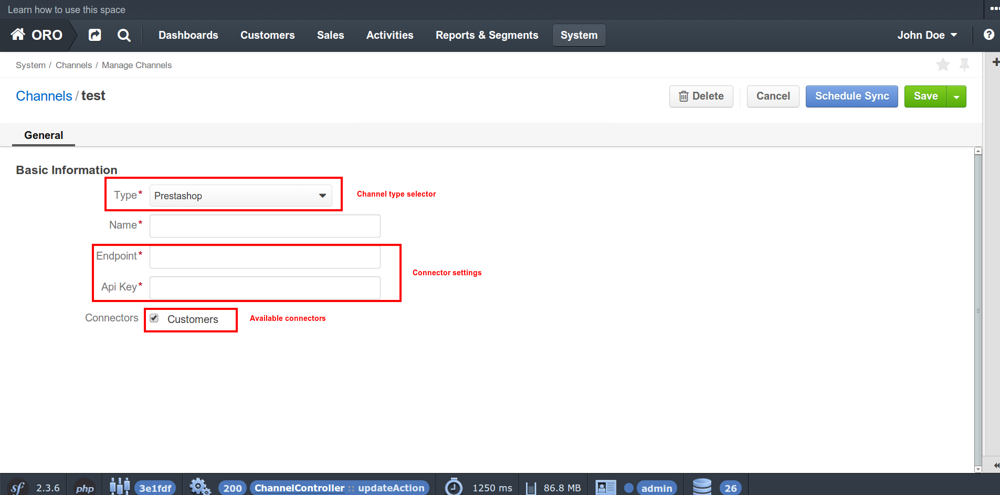

.. index::
    single: Integration
    single: Channel; Channel type

Introduction to Channels
========================

Overview
--------

**OroCRM** comes to us as multi channel CRM system based on **Oro Platform**.
What does exactly *"multi channel"* mean? What is *"channel"*? Multi channel implies that **OroCRM** can work with data
that comes from different sources, such as contact forms, e-commerce websites, ERP-systems, or whatever you want. So, basically
**channel** is some kind of data source to work with.

Oro Platform built-in facilities
--------------------------------

In the same time **Oro Platform** is the foundation for modern web applications(where the lion's share is e-commerce
specific applications) and it comes with set of built-in features that relate to integration and business entities.

**OroBusinessEntitiesBundle** - defines abstraction classes for the most popular data types. There are *cart*, *cart item*,
*order*, *order item*, *person*, *person group* and *product* entities. Those classes are based on generalized structures from
`schema.org <http://schema.org>`_ with some improvements. Those entities may be extended with platform specific fields,
but definition on the platform level might be useful when some kind of data processing needs to be done for all types of
data. For example, it might be useful to display grid with all customers that come from different systems and have different
sets of attributes, but developer could rely on fields from abstraction level and show information that is shared between
all of them.

**OroIntegrationBundle** - is responsible for interaction between third party systems/services and the platform. It extends
**OroImportExportBundle** to process data in background using other platform features such as cron and process queue.
General purpose of this bundle is allowing developers to create integration bundles and providing basic UI for its configuration.

OroIntegrationBundle's terms
----------------------------

.. image:: images/elephants.jpg
   :alt:   Integration bundle elephants
   :align: right

OroIntegrationBundle provides 4 terms:  *channel type*, *channel*, *transport*, *connector*.

So, let's determine what each of them means.

Channel type
    It groups related to single third party application service classes and objects. For example: magento channel type,
    google channel type etc

Channel
    It is configured instance of specific channel type and includes set of configuration(such as connection settings etc)

Transport
    It's an object that knows how to retrieve data from channel instance. It knows which entity should store connection settings,
    label for UI usage and form type, that is responsible for bringing settings from channel creation page. Example of the transport:
    SOAP transport, REST transport, direct database connection and much more.

Connector
    Generally, it is a reader in terms of OroImportExportBundle. Connector knows how to retrieve data of the specific type from remote instance,
    using any type of compatible transport for determined channel. Example of the connector: Customer connector for ebay channel type.

Let's put them in one chain. So, we are able to create *channel* that is an instance of some *channel type* and contains
some set of configuration such as which one *transport* to use to retrieve data specified by enabled *connectors*.

More technical information can be found in bundle's `readme <https://github.com/orocrm/platform/blob/master/src/Oro/Bundle/IntegrationBundle/README.md>`_.

Put them all together
---------------------

Now, when we know how pieces of *OroIntegrationBundle* work, we can move on to practical example. Our example will provide
simple integration with popular e-commerce solution **PrestaShop**.

For this tutorial we'll use latest versions of **OroCRM** - 1.2 and **Prestashop** - 1.6.0.6 at the moment. Each step of the tutorial will
have correspond tag in the repository.

After installation of the **OroCRM** clone `bundle repository <https://github.com/alsma-magecore/OroTutorialPrestashopBundle>`_
into ``src/`` folder. We will use *OroTutorial* namespace.

Step 1: Bundle creation
^^^^^^^^^^^^^^^^^^^^^^^

Let's create new *PrestashopBundle* bundle in the way described
in `documentation <http://www.orocrm.com/documentation/index/current/cookbook/how-to-create-new-bundle>`_. We have to
create bundle folder and add *OroTutorialPrestashopBundle* and *bundles.yml* config. After it's done we can clear cache
and check that bundle is loaded in symfony's debuger.

.. image:: ./images/debug_panel_bundle_check.png

.. note::

    Please checkout **step_1** tag.

Step 2: Initialize entities
^^^^^^^^^^^^^^^^^^^^^^^^^^^

We will develop *customer connector* to import customer data from our demo shop. Let's create entity for data storing.
This will be **CustomerEntity** that will extend **BasePerson** entity from *OroBusinessEntitiesBundle*.

.. code-block:: php

    <?php
    // src/OroTutorial/Bundle/PrestashopBundle/Entity/Customer.php
    namespace OroTutorial\Bundle\PrestashopBundle\Entity;

    use Doctrine\ORM\Mapping as ORM;

    use Oro\Bundle\BusinessEntitiesBundle\Entity\BasePerson;
    use Oro\Bundle\IntegrationBundle\Model\IntegrationEntityTrait;

    /**
     * @ORM\Entity
     * @ORM\Table(
     *      name="ot_prestashop_customer",
     *      uniqueConstraints={@ORM\UniqueConstraint(name="unq_remote_id_channel_id", columns={"remote_id", "channel_id"})}
     * )
     */
    class Customer extends BasePerson
    {
        use IntegrationEntityTrait;

        /*
         * Do not use addresses in tutorial
         */
        protected $addresses;

        /**
         * @var integer
         *
         * @ORM\Column(name="remote_id", type="integer", options={"unsigned"=true}, nullable=false)
         */
        protected $remoteId;

        /**
         * @param int $remoteId
         *
         * @return $this
         */
        public function setRemoteId($remoteId)
        {
            $this->remoteId = $remoteId;
        }

        /**
         * @return int
         */
        public function getRemoteId()
        {
            return $this->remoteId;
        }
    }

We will create simplified version of the import and will improve it in next tutorials. So, let's skip customer addresses for now.

What's going on ? We defined regular doctrine entity that inherit all fields from *BasePerson* except addresses.
Also we added *ManyToOne* relation on *Channel* entity, in order to track from what channel instance customer come. Another field we added is
**remoteId** it needs to match local customer with remote one. Now we have to develop migration script and installer for newly created table.
We will skip it's code here(see it on `github <https://github.com/alsma-magecore/OroTutorialPrestashopBundle/blob/step_2/OroTutorial/Bundle/PrestashopBundle/Migrations/Schema/v1_0/OroTutorialPrestashopBundle.php>`_ ),
you can refer to the `documentation <https://github.com/orocrm/platform/blob/master/src/Oro/Bundle/MigrationBundle/README.md>`_ how to develop it.

When migration is ready it can be executed by following console command:

.. code-block:: bash

    # from platform's root folder
    app/console oro:migration:load --show-queries --force

Now we can check it's structure.

.. code-block:: bash

    mysql> DESCRIBE ot_prestashop_customer;
    +-------------+------------------+------+-----+---------+----------------+
    | Field       | Type             | Null | Key | Default | Extra          |
    +-------------+------------------+------+-----+---------+----------------+
    | id          | int(11)          | NO   | PRI | NULL    | auto_increment |
    | channel_id  | smallint(6)      | YES  | MUL | NULL    |                |
    | remote_id   | int(10) unsigned | NO   | MUL | NULL    |                |
    | name_prefix | varchar(255)     | YES  |     | NULL    |                |
    | first_name  | varchar(255)     | YES  |     | NULL    |                |
    | middle_name | varchar(255)     | YES  |     | NULL    |                |
    | last_name   | varchar(255)     | YES  |     | NULL    |                |
    | name_suffix | varchar(255)     | YES  |     | NULL    |                |
    | gender      | varchar(8)       | YES  |     | NULL    |                |
    | birthday    | datetime         | YES  |     | NULL    |                |
    | email       | varchar(255)     | YES  |     | NULL    |                |
    | createdAt   | datetime         | NO   |     | NULL    |                |
    | updatedAt   | datetime         | NO   |     | NULL    |                |
    +-------------+------------------+------+-----+---------+----------------+
    13 rows in set (0.00 sec)

.. note::

    Please checkout **step_2** tag.

Step 3: Channel type
^^^^^^^^^^^^^^^^^^^^

Now it's time to define new **channel type**. Our bundle defines additional services in DIC because of this we should add bundle extension,
that will load our config.

.. code-block:: php

    <?php
    // src/OroTutorial/Bundle/PrestashopBundle/DependencyInjection/OroTutorialPrestashopExtension.php
    namespace OroTutorial\Bundle\PrestashopBundle\DependencyInjection;

    use Symfony\Component\Config\FileLocator;
    use Symfony\Component\DependencyInjection\Loader;
    use Symfony\Component\DependencyInjection\ContainerBuilder;
    use Symfony\Component\HttpKernel\DependencyInjection\Extension;

    class OroTutorialPrestashopExtension extends Extension
    {
        /**
         * {@inheritDoc}
         */
        public function load(array $configs, ContainerBuilder $container)
        {
            $loader = new Loader\YamlFileLoader($container, new FileLocator(__DIR__ . '/../Resources/config'));
            $loader->load('services.yml');
        }
    }

Then we are creating our channel type class. It's placed into *Provider* folder and called *PrestashopChannelType*.
As described in the `documentation <https://github.com/orocrm/platform/blob/master/src/Oro/Bundle/IntegrationBundle/README.md#channel-type-definition>`_
it should implements ``Oro\Bundle\IntegrationBundle\Provider\ChannelInterface`` that is very simple. Let's do it!

.. code-block:: php

    <?php
    // src/OroTutorial/Bundle/PrestashopBundle/Provider/PrestashopChannelType.php
    namespace OroTutorial\Bundle\PrestashopBundle\Provider;

    use Oro\Bundle\IntegrationBundle\Provider\ChannelInterface;

    class PrestashopChannelType implements ChannelInterface
    {
        /**
         * {@inheritdoc}
         */
        public function getLabel()
        {
            return 'Prestashop'; // this string will be translated via symfony's translator
        }
    }

Transport declaration requires three steps:

* Implement transport type(dummy for this step)
* Create form that will shown on channel configuration page
* Create entity that will store transport settings

.. code-block:: php

    <?php
    // src/OroTutorial/Bundle/PrestashopBundle/Provider/RestTransport.php
    namespace OroTutorial\Bundle\PrestashopBundle\Provider;

    use Oro\Bundle\IntegrationBundle\Entity\Transport;
    use Oro\Bundle\IntegrationBundle\Provider\TransportInterface;

    use OroTutorial\Bundle\PrestashopBundle\Form\Type\RestTransportType;

    class RestTransport implements TransportInterface
    {
        /**
         * {@inheritdoc}
         */
        public function init(Transport $settings)
        {
            // TODO: Implement init() method.
        }

        /**
         * {@inheritdoc}
         */
        public function call($action, $params = [])
        {
            // TODO: Implement call() method.
        }

        /**
         * {@inheritdoc}
         */
        public function getLabel()
        {
            return 'REST'; // this string will be translated via symfony's translator
        }

        /**
         * {@inheritdoc}
         */
        public function getSettingsFormType()
        {
            return RestTransportType::NAME;
        }

        /**
         * {@inheritdoc}
         */
        public function getSettingsEntityFQCN()
        {
            return 'OroTutorial\Bundle\PrestashopBundle\Entity\RestTransport';
        }
    }

Interface says that we need to implement following methods:

* **init** - configure transport by it's settings
* **call** - do some action with remote instance
* **getLabel** - returns label for UI (if channel have only one transport than selector will not be shown)
* **getSettingsFormType** - returns form type to bring settings (will be added next)
* **getSettingsEntityFQCN** - entity class name to store settings in

Prestashop API requires API key and connection endpoint to interact with. So, those are transport settings and they will be
stored in the database. Transport settings entity should extends ``Oro\Bundle\IntegrationBundle\Entity\Transport``.
It uses doctrine single table inheritance and better to prefix your fields in some way.
Here it is.

.. code-block:: php

    <?php
    // src/OroTutorial/Bundle/PrestashopBundle/Entity/RestTransport.php
    namespace OroTutorial\Bundle\PrestashopBundle\Entity;

    use Doctrine\ORM\Mapping as ORM;

    use Symfony\Component\HttpFoundation\ParameterBag;
    use Symfony\Component\Validator\Constraints as Assert;

    use Oro\Bundle\IntegrationBundle\Entity\Transport;

    /**
     * @ORM\Entity
     */
    class RestTransport extends Transport
    {
        /**
         * @var string
         *
         * @ORM\Column(name="prestashop_rest_endpoint", type="string", length=255, nullable=false)
         * @Assert\NotBlank()
         * @Assert\Length(max=255)
         */
        protected $endpoint;

        /**
         * @var string
         *
         * @ORM\Column(name="prestashop_rest_api_key", type="string", length=255, nullable=false)
         * @Assert\NotBlank()
         * @Assert\Length(max=255)
         */
        protected $apiKey;

        /**
         * @param string $apiKey
         */
        public function setApiKey($apiKey)
        {
            $this->apiKey = $apiKey;
        }

        /**
         * @return string
         */
        public function getApiKey()
        {
            return $this->apiKey;
        }

        /**
         * @param string $endpoint
         */
        public function setEndpoint($endpoint)
        {
            $this->endpoint = $endpoint;
        }

        /**
         * @return string
         */
        public function getEndpoint()
        {
            return $this->endpoint;
        }

        /**
         * {@inheritdoc}
         */
        public function getSettingsBag()
        {
            return new ParameterBag(['endpoint' => $this->endpoint, 'api_key' => $this->apiKey]);
        }
    }

We'll skip migration code here, but keep in mind that it's also required.
I hope that entity fields are self explainable and we can move forward.
Now the time is to create form type to fill the settings into entity.

.. code-block:: php

    <?php
    // src/OroTutorial/Bundle/PrestashopBundle/Form/Type/RestTransportType.php
    namespace OroTutorial\Bundle\PrestashopBundle\Form\Type;

    use Symfony\Component\Form\AbstractType;
    use Symfony\Component\Form\FormBuilderInterface;
    use Symfony\Component\OptionsResolver\OptionsResolverInterface;

    use OroTutorial\Bundle\PrestashopBundle\Provider\RestTransport;

    class RestTransportType extends AbstractType
    {
        const NAME = 'oro_tutorial_prestashop_form_rest_transport_type';

        /** @var RestTransport */
        protected $transport;

        /**
         * @param RestTransport $transport
         */
        public function __construct(RestTransport $transport)
        {
            $this->transport = $transport;
        }

        /**
         * {@inheritdoc}
         */
        public function getName()
        {
            return self::NAME;
        }

        /**
         * {@inheritdoc}
         */
        public function buildForm(FormBuilderInterface $builder, array $options)
        {
            $builder->add(
                'endpoint',
                'text',
                ['label' => 'Endpoint', 'required' => true]
            );
            $builder->add(
                'apiKey',
                'password',
                ['label' => 'Api Key', 'required' => true]
            );
        }

        /**
         * {@inheritdoc}
         */
        public function setDefaultOptions(OptionsResolverInterface $resolver)
        {
            $resolver->setDefaults(['data_class' => $this->transport->getSettingsEntityFQCN()]);
        }
    }

We injected the *real transport* object into the form type to get entity class name. Also please take into account that we skipped
api key encryption, but it's required for the real world usage.
Let's define connector class(dummy for this step).

.. code-block:: php

    <?php
    // src/OroTutorial/Bundle/PrestashopBundle/Provider/CustomerConnector.php
    namespace OroTutorial\Bundle\PrestashopBundle\Provider;

    use Oro\Bundle\IntegrationBundle\Provider\AbstractConnector;

    class CustomerConnector extends AbstractConnector
    {
        /**
         * {@inheritdoc}
         */
        public function getLabel()
        {
            return 'Customers'; // this string will be translated via symfony's translator
        }

        /**
         * {@inheritdoc}
         */
        public function getImportEntityFQCN()
        {
            return 'OroTutorial\Bundle\PrestashopBundle\Entity\Customer';
        }

        /**
         * {@inheritdoc}
         */
        public function getImportJobName()
        {
            // TODO: Implement getImportJobName() method.
        }

        /**
         * {@inheritdoc}
         */
        public function getType()
        {
            return 'customer';
        }

        /**
         * {@inheritdoc}
         */
        protected function getConnectorSource()
        {
            // TODO: Implement getConnectorSource() method.
        }
    }

We will put the implementation of the import in next tutorial, so put just empty methods for now.
Last thing left is to declare services.

.. code-block:: yaml

    # src/OroTutorial/Bundle/PrestashopBundle/Resources/config/services.yml
    parameters:
        oro_tutorial.prestashop.provider.rest_transport.class:          OroTutorial\Bundle\PrestashopBundle\Provider\RestTransport
        oro_tutorial.prestashop.provider.prestashop_channel_type.class: OroTutorial\Bundle\PrestashopBundle\Provider\PrestashopChannelType
        oro_tutorial.prestashop.provider.customer_connector.class:      OroTutorial\Bundle\PrestashopBundle\Provider\CustomerConnector
        oro_tutorial.prestashop.form.type.rest_transport.type.class:    OroTutorial\Bundle\PrestashopBundle\Form\Type\RestTransportType

    services:
        oro_tutorial.prestashop.provider.prestashop_channel_type:
            class: %oro_tutorial.prestashop.provider.prestashop_channel_type.class%
            tags:
                - { name: oro_integration.channel, type: presta_shop }

        oro_tutorial.prestashop.provider.rest_transport:
            class: %oro_tutorial.prestashop.provider.rest_transport.class%
            tags:
                - { name: oro_integration.transport, type: rest, channel_type: presta_shop }

        oro_tutorial.prestashop.provider.customer_connector:
            class: %oro_tutorial.prestashop.provider.customer_connector.class%
            arguments:
              - @oro_importexport.context_registry
              - @oro_integration.logger.strategy
              - @oro_integration.provider.connector_context_mediator
            tags:
                - { name: oro_integration.connector, type: customer, channel_type: presta_shop }

        oro_tutorial.prestashop.form.type.rest_transport.type:
            class: %oro_tutorial.prestashop.form.type.rest_transport.type.class%
            arguments:
              - @oro_tutorial.prestashop.provider.rest_transport
            tags:
              - { name: form.type, alias: oro_tutorial_prestashop_form_rest_transport_type }

Clear cache and check it out.

.. note::

    Please checkout **step_3** tag.
